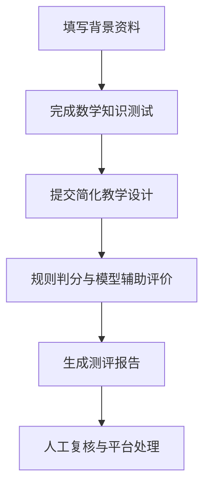

# tutor-teaching-assessment# 初中数学家教教学能力测评系统

面向大学生家教的基础教学能力测评、准入辅助与改进建议工具。

**项目状态：需求定义与原型设计阶段。** 本文描述第一版产品规划，不代表相关功能已经实现，也不代表评分标准已经通过实证验证。目前暂无可运行的应用版本。

## 项目简介

本项目拟通过“教师背景信息＋初中数学知识测试＋简化教学设计”，帮助家教平台了解大学生家教的学科基础和初步教学设计能力。第一版聚焦初中数学一对一辅导，尤其关注非师范专业大学生能否将自己掌握的知识转化为学生可以理解、练习和应用的内容。

系统以 DeepSeek 为文本分析与反馈生成组件，结合明确的评分规则和人工复核，输出分项得分、综合结果、问题证据与改进建议。项目开发的是接入大语言模型的测评应用，不是从零训练一个基础模型。

学历、专业、高考成绩等纳入内部背景资料，但不直接等同于教学能力；仅凭笔试和教学设计，也不能认定一个人的实际课堂教学质量。

## 5W1H 问题定义

| 维度 | 项目定义 |
| --- | --- |
| Why 为什么做 | 需要检验的项目假设是：部分大学生能够解题，但在理解学生错误、组织讲解和检查学习效果方面经验不足。平台需要在背景审核之外，增加可解释的基础能力测评。该需求仍需通过访谈和试测验证。 |
| What 做什么 | 构建轻量化测评系统，完成信息采集、数学测试、教学设计评价、分数汇总、问题诊断与改进建议。 |
| Who 为谁做 | 直接用户为申请入驻的大学生家教与平台审核人员；学生、家长为间接受益者。开发团队由教育学与计算机、软件工程方向成员协作组成。 |
| When 何时用 | 第一版用于首次申请入驻时的基础测评；定期复测、训练后复测作为后续扩展。 |
| Where 在哪里用 | 第一版拟采用网页端，由教师在线提交材料，平台审核人员查看报告；小程序等其他入口后续考虑。 |
| How 如何实现 | 人工审核题库与评分量表，程序完成确定性判分与汇总，DeepSeek 按量表分析教学设计，人工复核边界结果与异常结果。 |

## 产品描述

### 使用流程

### 核心功能

| 功能模块 | 输入 | 处理方式 | 输出 |
| --- | --- | --- | --- |
| 背景信息采集 | 学历或在读情况、专业、是否师范生、高考成绩等 | 表单校验，记录资料来源及核验状态 | 教师背景档案 |
| 数学知识测试 | 初中数学题目及作答 | 客观题按参考答案判分；开放解答保留人工复核入口 | 学科得分、错题与知识点标签 |
| 教学设计填写 | 统一提供的年级、知识点、学生情况与任务 | 按简化表单提交文本 | 结构化教学设计 |
| 教学设计评价 | 教学设计、评分量表与参考案例 | DeepSeek 辅助分析；后端校验输出格式和分数范围 | 分项得分、对应原文证据与评价理由 |
| 综合评分 | 有效的测试结果与评价结果 | 后端按可配置规则计算 | 综合分、分项结果、准入建议 |
| 问题诊断与建议 | 错题、评分证据及短板 | 规则与模型共同生成有依据的反馈 | 主要问题及可执行的改进任务 |
| 报告与审核 | 完整测评记录 | 教师查看本人结果，审核人员复核与备注 | 可解释的测评报告及审核记录 |

### 简化教学设计

只围绕一个知识点设计一段短时辅导，不要求撰写完整的专业教案，也不以教育学术语使用多少作为评分依据。

| 表单区域 | 填写内容 |
| --- | --- |
| 基本信息 | 带教年级、学科、知识点、预计辅导时长 |
| 学生情况与目标 | 学生已经会什么、具体哪里不会、本次希望学生做到什么 |
| 教学过程 | 如何了解问题、解释示范、安排练习，以及根据学生表现调整 |
| 学习效果检查 | 用什么题目或任务检查，以及怎样判断学生基本学会 |

测评任务中的学生情况由题目统一给定，避免不同填写者自行设定完全不同的难度。第一版使用在线文本表单，不要求图片识别、视频分析或实时语音交互。

## 评分与结果解释

### 评分结构草案

以下保留前期讨论中的权重方案，仅用于需求讨论和开发配置，**不是已验证的准入标准**。正式权重与阈值需要教育学成员组织试测、比较人工评价后确定。

| 维度 | 前期建议权重 | 使用说明 |
| --- | ---: | --- |
| 基本信息与背景 | 10% | 是否计分及如何计分仍待确认；不得用学校、专业标签直接替代教学能力判断。 |
| 初中数学知识 | 40% | 关注知识与解题是否正确，并设置不可由其他分数补偿的基础要求。 |
| 教学设计质量 | 40% | 关注学生问题、目标、讲解、练习与检查之间是否对应。 |
| 表达与规范性 | 10% | 仅评价说明是否清楚、任务是否完整；避免与教学设计重复计分，不奖励术语堆砌或排版美观。 |

如保留高考成绩，应同时记录年份、地区、科目及满分等必要背景；未经处理的原始分数不能直接跨考试情境比较。模型评价教学设计时，不输入学校名称、高考成绩等无关背景，减少背景信息对内容评价的干扰。

### 输出要求

- 分项结果必须能够追溯到作答、评分条目或教学设计原文，不只输出一个总分。
- 建议结果分为“基础准入”“有条件准入”“暂不准入”，具体条件待试测确定，由平台人员复核后使用。
- “有条件准入”不等于系统自动开放接单；产品第一版只提供辅助判断，不直接执行接单授权。
- 材料缺失、接口失败、模型输出不合格或评分存在争议时，标记为“待补充”或“待复核”，不得自动当作不通过。
- 改进建议应对应实际问题，说明下一步练习什么、怎样练习；没有足够证据时不强行凑出固定数量的问题。

## 智能体与系统分工

| 组成 | 负责内容 | 不负责内容 |
| --- | --- | --- |
| 教育评价规则 | 题库审核、量表、参考样例、评分底线和复核规则 | 不通过单次模型输出认定标准有效 |
| DeepSeek | 按量表分析文本、引用评价证据、生成改进建议 | 不自行修改评分标准，不管理用户权限，不直接授予准入资格 |
| 后端程序 | 流程管理、答案校验、结构化输出校验、计算汇总、记录版本 | 不把接口错误当成教师能力不足 |
| 前端界面 | 信息填写、作答、报告呈现、复核入口 | 不暴露 API 密钥，不直接调用带密钥的模型接口 |
| 人工审核 | 复核边界结果、争议结果与疑似数学错误，确认平台处理 | 不把模型分数当作唯一决策依据 |

模型输出拟使用固定字段，例如评分维度、分数、原文证据、理由、建议及复核标记。具体模型型号、接口参数和依赖版本在接入阶段确认，并记录到项目文档。

## 第一版范围

### 纳入 MVP

- 大学生家教背景表单与测评流程。
- 一套经人工审核的初中数学基础题目。
- 一份简化教学设计任务与对应评分量表。
- DeepSeek 文本评价、规则汇总和测评报告。
- 基础权限控制、异常提示与人工复核。

### 暂不纳入

- 教学设计图片 OCR、课堂视频与表情分析。
- 实时语音、模拟学生对话、自动培训课程。
- 多学科同时上线、长期教学效果预测。
- 订单交易、支付与自动接单授权。
- 教师资格认定或真实课堂教学质量认证。

## 仓库组织

下列为建议目录规划；除已有需求文档外，相关源码、测试和协作文档需要随开发逐步建立，不代表当前已经存在。

| 路径 | 用途 |
| --- | --- |
| `README.md` | 项目入口、产品概览与协作说明 |
| `docs/requirements/problem_definition.md` | 5W1H 报告与详细产品描述 |
| `docs/algorithm/` | 评分量表、提示词、评价样例与验证记录 |
| `docs/software/` | 接口、数据结构与部署说明 |
| `docs/mgmt/` | 分工、任务清单与迭代计划 |
| `docs/retrospection/` | 阶段复盘与问题总结 |
| `code/frontend/` | 表单、测试与报告页面 |
| `code/backend/` | 用户、题库、测评流程及数据存储 |
| `code/core_engine/` | 模型接入、输出校验与评分汇总 |
| `tests/unit/`、`tests/integration/` | 单元测试与流程集成测试 |
| `.github/workflows/` | 后续配置自动化检查 |

## 团队分工建议

按一名教育学成员与四名技术成员安排，具体人员姓名由小组补充。

| 角色 | 主要工作 | 交付物 |
| --- | --- | --- |
| 教育学成员 | 明确测评维度、审核题目、编写量表和参考案例，组织人工评审 | 题库、评分规则、样例与试测记录 |
| 技术成员 A | 前端表单、测试页面、教学设计提交和报告展示 | 可操作的用户界面 |
| 技术成员 B | 后端流程、数据库、账号权限与审核接口 | 后端服务及接口文档 |
| 技术成员 C | DeepSeek 接入、提示词、结构化输出及异常处理 | 模型分析组件及校验测试 |
| 技术成员 D | 评分汇总、联调、测试与部署，协助报告功能 | 规则组件、测试记录与部署说明 |

## 开发路线与验收

以下为计划清单，不表示已完成。

- [ ] 确认需求范围、评分结构及团队分工。
- [ ] 建立题库、简化教学设计任务、量表和人工评分样例。
- [ ] 完成表单、测试、提交与报告的基础流程。
- [ ] 接入 DeepSeek，并验证返回结构及异常处理。
- [ ] 校验客观题判分、加权计算与边界条件。
- [ ] 组织小规模试测，对比人工与模型评分，记录重复评分差异。
- [ ] 验证报告中的证据和建议能够对应原始作答。
- [ ] 完成权限、隐私、失败重试和人工复核测试。
- [ ] 补齐安装、运行、测试和部署说明。

只有在题库、量表与人机评分对比完成必要验证后，才讨论将结果用于实际平台筛选；课堂教学效果仍需后续真实教学证据支持。

## 协作方式

- 使用 Issues 记录需求、任务、缺陷和待确认问题。
- 使用看板管理待办、进行中、待评审、已完成等状态，并标明负责人。
- 按课程要求拟采用 `main`、`develop` 与功能分支协作，通过 Pull Request 评审后合并。
- 需求变动应同步更新 README 和详细需求文档；评分规则、提示词及样例应保留版本记录。

这些是仓库协作约定草案，分支、看板和自动化检查仍需实际配置。

## 运行说明

当前为需求设计阶段，尚无可执行应用、安装命令或线上演示地址。技术栈、环境变量清单、启动方式与测试命令将在首个可运行版本中补充，不提供尚未验证的运行指令。

## 数据与使用边界

- 本仓库只存放代码、文档和合成或去标识化样例，不提交真实身份证明、成绩证明、学生资料或教师完整测评记录。
- API 密钥通过服务端安全配置管理，不写入源码、README、前端代码或版本库。
- 发送给模型的内容应限于评价所需文本，避免包含真实姓名、联系方式等无关个人信息。
- 第一版属于测评辅助与研究原型，不代替教师资格审核、真实教学观察或平台人工决策。

## 许可证

许可证待团队确认。仓库公开与选择开源许可证是不同决定，发布时需单独确认代码及文档的授权方式。
